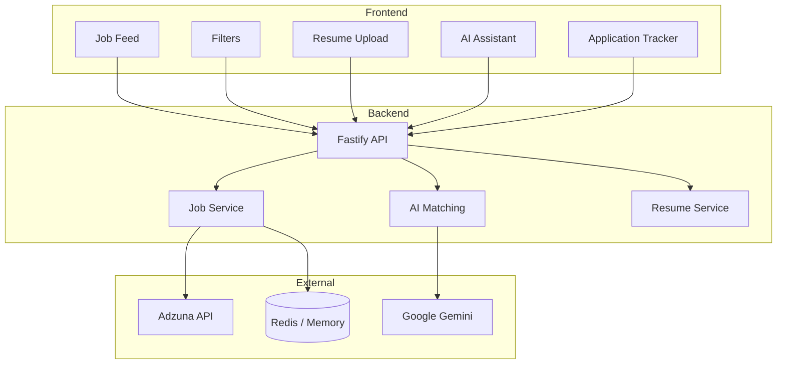

# JobMatch AI – AI-Powered Job Tracker with Smart Matching

This project was built as part of an internship assignment and demonstrates end-to-end full-stack development, clean UI/UX design, and practical AI integration.

An intelligent job tracking system that fetches jobs from external APIs, matches them with a user's resume using AI, provides smart application tracking, and includes a conversational AI assistant to help users navigate their job search efficiently.

---

## 🔗 Live Demo

- **Frontend**: https://smart-job-tracker-ochre.vercel.app
- **Backend API**: https://smart-job-tracker-backend-r5wd.onrender.com
- **GitHub Repository**: https://github.com/Sarfarazsfz/smart-job-tracker

**Demo Note**: Upload a resume to enable AI-based job matching and personalized match scores.

---

## ✨ Key Features

### Core Functionality
- Job feed powered by an external job API (India-focused listings)
- Resume upload (PDF/TXT) with automatic text extraction
- AI-based job–resume matching with percentage scores
- **Best Matches for You** section highlighting top matches
- Smart application tracking with confirmation popup
- Conversational AI assistant for job discovery and guidance
- Fully responsive UI (mobile, tablet, desktop)

### Filters (Assignment Requirement)
- **Role / Job Title** search
- **Skills** (multi-select: React, Node.js, Python, etc.)
- **Date Posted** (Last 24 hours, Last week, Last month, Any time)
- **Job Type** (Full-time, Part-time, Contract, Internship)
- **Work Mode** (Remote, Hybrid, On-site)
- **Location** (City / Region)
- **Match Score** (High >70%, Medium 40–70%, All)

---

## 🏗️ Project Architecture

The application follows a clean three-tier architecture:

### 1. Presentation Layer (Frontend)
- React + Vite
- Client-side filtering and ranking for instant UX
- State managed with React hooks
- Dark-mode focused, professional UI

### 2. Application Layer (Backend)
- Node.js + Fastify
- REST APIs
- Job fetching, resume processing, AI orchestration
- Cache-first design for performance

### 3. Data & External Services
- Adzuna API for job listings
- Google Gemini for AI matching (with fallback logic)
- Upstash Redis (or in-memory fallback) for caching

### Architecture Diagram



---

## 🤖 AI Matching Logic

### Overview
The system calculates a job–resume match score (0–100%) using a weighted approach:
- **Skill Match**: 45%
- **Experience Level**: 30%
- **Title Relevance**: 25%

### How It Works
1. Extract skills and keywords from resume and job description
2. Calculate skill overlap
3. Detect experience level alignment
4. Match job title relevance
5. Combine weighted scores into a final percentage

### Match Categories
- **High (70–100%)** – Strong match
- **Medium (40–69%)** – Moderate match
- **Low (<40%)** – Weak match

Match scores are calculated once after resume upload and reused across filters.

---

## 🎯 Smart Application Popup (Critical Thinking)

**Problem**: Applications happen on external job portals (LinkedIn, company sites).

**Constraint**: Browser security prevents tracking actions on external websites.

**Solution**: When a user returns to the app tab after clicking Apply, a popup asks:
- Yes, Applied
- Applied Earlier
- No, Just Browsing

This approach ensures accurate application tracking without violating user privacy.

---

## ⚡ Caching & Performance

- Jobs fetched in batches of 50
- Cache-first strategy with 1-hour TTL
- Jobs fetched only when cache expires
- Filters and search applied client-side
- Reduces API usage while keeping listings fresh

---

## 📈 Scalability Considerations

- Handles 100 jobs efficiently using parallel processing
- Architecture supports scaling to 10,000 users
- Stateless backend design
- Redis used for fast access and caching
- Clear migration path to PostgreSQL + background job queues

---

## ⚖️ Tradeoffs & Limitations

### Current Limitations
- No authentication (single-user demo model)
- Redis / in-memory storage (not a permanent database)
- AI scoring latency depends on external APIs
- Single job data source

### Future Improvements
- User authentication (OAuth)
- Persistent database (PostgreSQL)
- Background job queue for AI scoring
- Multi-source job aggregation
- Email alerts and saved searches

---

## 🛠️ Setup Instructions

### Prerequisites
- Node.js 18+
- npm or yarn
- Optional API keys (Adzuna, Gemini, Redis)

### Run Locally

```bash
git clone https://github.com/Sarfarazsfz/smart-job-tracker.git
cd smart-job-tracker

# Backend
cd backend
npm install
cp .env.example .env
npm run dev

# Frontend
cd ../frontend
npm install
npm run dev
```

**Open**: http://localhost:5173

---

## 📚 Documentation

Detailed references are available in the `/docs` folder:
- **API.md** – API endpoints and request/response details
- **DEPLOYMENT.md** – Production deployment steps

---

## 📝 License

MIT License

---

## 📧 Contact

- **GitHub**: https://github.com/Sarfarazsfz
- **LinkedIn**: https://www.linkedin.com/in/faraz4237/
