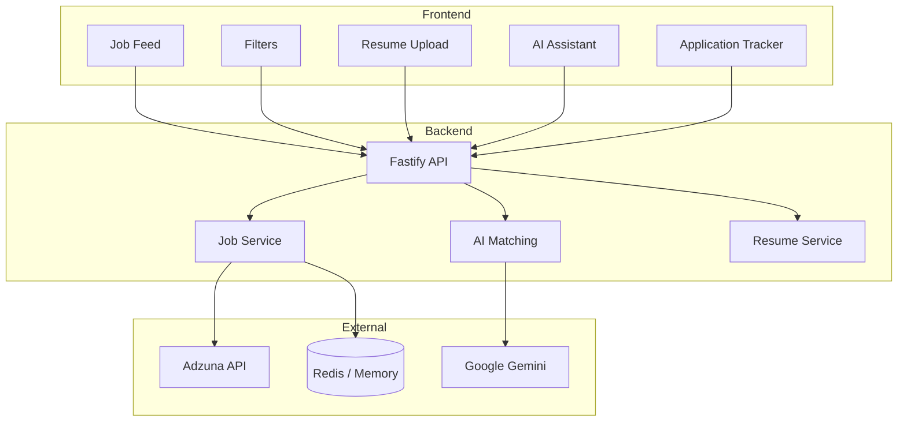

# JobMatch AI – AI-Powered Job Tracker with Smart Matching

This project was built as part of an internship assignment and demonstrates end-to-end full-stack development, clean UI/UX design, and practical AI integration.

An intelligent job tracking system that fetches jobs from external APIs, matches them with a user's resume using AI, provides smart application tracking, and includes a conversational AI assistant to help users navigate their job search efficiently.

---

## Live Demo

- **Frontend**: https://smart-job-tracker-ochre.vercel.app
- **Backend API**: https://smart-job-tracker-backend-r5wd.onrender.com
- **GitHub Repository**: https://github.com/akhila-3010

**Demo Note**: Upload a resume to enable AI-based job matching and personalized match scores.

---

## a) Architecture Diagram

The application follows a clean three-tier architecture:

### 1. Presentation Layer (Frontend)
- React + Vite
- Client-side filtering and ranking for instant UX
- State managed with React hooks
- Dark-mode focused, professional UI

### 2. Application Layer (Backend)
- Node.js + Fastify
- REST APIs
- Job fetching, resume processing, AI orchestration
- Cache-first design for performance

### 3. Data & External Services
- Adzuna API for job listings
- Google Gemini for AI matching (with fallback logic)
- Upstash Redis (or in-memory fallback) for caching

### Architecture Diagram


Data Flow

. Frontend requests job data

. Backend fetches jobs from external API (cached)

. Resume is uploaded and parsed

. LangChain calculates match scores

. LangGraph powers AI assistant responses

. Results returned to frontend for filtering and display

---

## b) Setup Instructions

### Prerequisites
- Node.js 18+
- npm or yarn
- Optional API keys (Adzuna, Gemini, Redis)

### Run Locally

```bash
git clone https://github.com/akhila-3010/AI-Powered-Job-Tracker-Assignment.git
cd AI-Powered-Job-Tracker-Assignment

# Backend
cd backend
npm install
cp .env.example .env
npm run dev

# Frontend
cd ../frontend
npm install
npm run dev
```

**Open**: http://localhost:5173

Environment Variables

. PORT=3001
. JOB_API_KEY=your_key
. LLM_API_KEY=your_key
. REDIS_URL=optional
. FRONTEND_URL=http://localhost:5173


---

## c) LangChain & LangGraph Usage

### LangChain – Job Matching

LangChain is used to power intelligent job–resume matching by:

- Extracting skills from uploaded resumes
- Extracting requirements from job descriptions
- Comparing semantic similarity using LLM embeddings
- Generating structured and explainable match scores

Each resume–job pair is processed **once** after resume upload and the results are cached to avoid repeated AI calls.


### LangGraph – AI Assistant

LangGraph is used to implement a conversational AI assistant with predictable, stateful behavior.

#### Graph Structure
- **Start Node**: Receives user query
- **Intent Node**: Detects intent (job search, filter update, career advice)
- **Tool Node**: Calls backend tools (job search, filter updates)
- **Response Node**: Generates the final AI response

#### Tool / Function Calling
- Update UI filters (skills, location, job type)
- Trigger job searches
- Explain job–resume match scores

#### Prompt Design
- System prompt enforces a career-assistant persona
- User context includes current filters and resume summary
- Responses are constrained to short, actionable outputs

#### State Management
LangGraph state stores:
- Active filters
- Resume summary
- Current job context

This prevents repeated explanations and reduces hallucinations.

---

## d) AI Matching Logic

### Scoring Approach
- **Skill Match**: 45%
- **Experience Alignment**: 30%
- **Job Title Relevance**: 25%

Final Score = Weighted average (0–100%)

### Why It Works
- Skills dominate relevance and job fit
- Experience ensures correct seniority alignment
- Title relevance prevents misleading matches

### Performance Considerations
- Match scores calculated once per resume upload
- Cached results reused across filters
- No repeated LLM calls during normal browsing

---

## e) Popup Flow Design (Critical Thinking)

### Why This Design
Job applications redirect users to external portals where application completion cannot be tracked due to browser security restrictions.

### Solution
When the user returns to the app, a confirmation popup asks:
- Applied
- Applied Earlier
- Just Browsing

### Edge Cases Handled
- Multiple apply clicks
- Tab switching
- User abandoning application midway

### Alternatives Considered
- Browser extensions (rejected due to complexity)
- Email tracking (privacy concerns)
- Mandatory confirmation before redirect (poor UX)

The chosen approach balances **accuracy, privacy, and user experience**.

---

## f) AI Assistant UI Choice

### Sidebar / Chat Bubble Hybrid

### UX Reasoning
- Non-intrusive and lightweight
- Always accessible during browsing
- Does not block job listings
- Familiar chat-based interaction model

The assistant acts as a **guide**, not a distraction.

---

## g) Scalability

### Handling 100+ Jobs
- Client-side filtering
- Cached job batches
- Parallel AI matching

### Handling 10,000 Users
- Stateless backend architecture
- Redis caching
- Horizontal scaling ready
- External APIs safely rate-limited

The system is future-ready for database persistence and background queues.

---

## h) Tradeoffs

### Known Limitations
- No authentication (single-user demo model)
- Redis / in-memory storage (not a permanent database)
- AI scoring latency depends on external APIs
- Single job data source

### Future Improvements
- User authentication (OAuth)
- Persistent database (PostgreSQL)
- Background job queue for AI scoring
- Multi-source job aggregation
- Email alerts and saved searches

---

## Documentation

Detailed references are available in the `/docs` folder:
- **API.md** – API endpoints and request/response details
- **DEPLOYMENT.md** – Production deployment steps

---

## License

MIT License

---

## Contact

- **GitHub**: https://github.com/akhila-3010  


